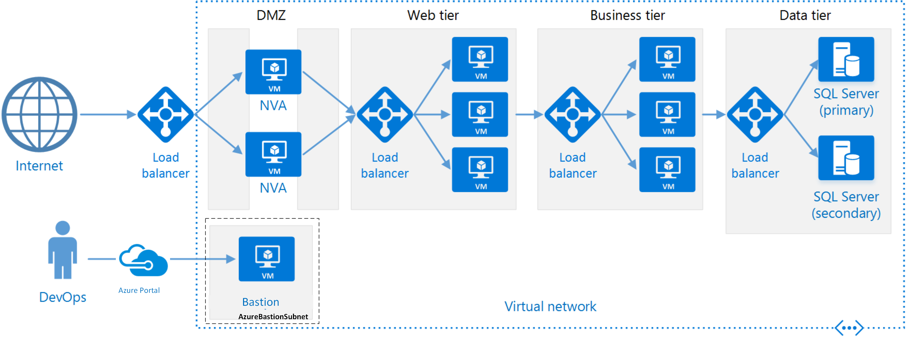
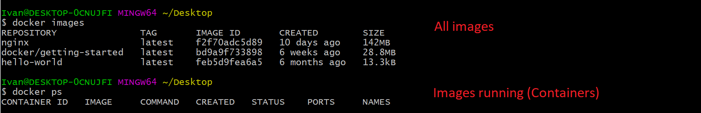

# SRE Intro
Role of an SRE
- to check and maitain the code, ensuring the application is running at all times, thus providing positive user experience
# User Journey
- the path a user would take in order to complete a task, e.g. log into their account to upload a picture that others can see
# User Experience
- the level of satisfaction a user feels after performing a User Journey, for  example a bad exprerience would come as a result of failing to upload a new picture and getting an error code, whereas a good experience can come from successfully uploading the desired picture
# Cloud computing with AWS (Amazon Web Services)
## AWS Definition
- A cloud platform providing organisations with the required server space to store their information on the cloud and make it easily available to its users without the need for the organisation to invest money into the infrastructure
## Global Infrastructure
- AWS has servers in regions accross the globe, with multiple availability zones
- most common choice for organisations
- It provides organisations with the ability to keep their data safe and in multiple locations to reduce the time taken for requesting the data from users.
- 26 different regions
- 84 availability zones
- plans for future expansion
## Benefits of Cloud Computing (Known as 4 pillars of Cloud Computing as well)
- Ease of use
  - data is stored online, meaning every team member views the same data and any updates are immediately available for the team to view
  - makes quality control easier as all data is stored in the same place, i.e. nothing is ever lost
- Flexible
  - can always add more Regions or more Availability zones on demand, without the need to plan the expansion and spend time building it
  - can choose the Region you want the data stored on
  - can choose from different services, using only the services you need the application to have
- Robust
  - maintained and kept secure by Amazon, with the company investing into the best security meaning your data is as secure as possible
  - cannot lose data as it is stored on the cloud, meaning all the servers that the data is stored on need to be destroyed for the data to be lost
- Cost
  - pay as you go for the services and storage space, meaning you never pay more than what you're using
  - initial cost is high, but in the long run you end up saving money because resources are never wasted
## Region VS Availability Zone
- Regions
  - The areas of the globe where AWS servers are located, for example London, Paris, etc.
- Availability zones
  - the number of servers within that area of the globe (Region)
## CDN Definition
- content delivery network
- a geographically distributed network of servers which work together to provide content to users
## On prem VS Hybrid VS Public Cloud
- On prem
  - storing all the data of the organisation on the premises of the organisation, in other words running an internal server maintained by the organisation itself
- Public Cloud
  - a server on the web that stores all of the companies data, which is fully maintained by a different organisation
  - For example, using AWS, the server space is used by the individual company, but the maintanance is done by Amazon
- Hybryd
  - storing some of the information within the internal organisation server, and some on a public server like AWS
  - For example, a bank might keep your card information within the banks internal server, but keep a credit application form on a public server
# AWS -> localhost and back
- Our desktop or laptop has set hardware and software on it
- AWS doesn't, so we need to specify the size we want it to have
- need credentials (username, password, AWS keys) to have access
- check diagram for more:

## How to launch an instance
- add file.pem into the .ssh folder `c/users/ivan/.ssh` if it doesn't exist make one
- go to AWS website using the secret link, login using secret details
- leave most things default
- add the groups (default network for now/ group is eu-west-1a)
- add security groups (SSH for your own machine, others can be http before deployment, https after deployment)
  - you already have a security group so could just reuse it
- then change permitions of the file (command will be generated by AWS)
- then connect using the link provided (most of this is explained on the AWS page you will open with the link)
  - if not type in `chmod 400 (file.pem)`
  - then type `ssh -i (os name (e.g. ubuntu))@(Public IPv4 DNS address)` ( seems to end with compute.amazonaws.com )
- run update, upgrade and install nginx:
  - `sudo apt-get update -y`
  - `sudo apt-get upgrade -y`
  - `sudo apt-get install nginx -y`
## Lounch from an image (AMI)
- Same as normal really, no real difference in the settings
# Linux Commands
- how to start a service `sudo systemctl start name_service`
- how to stop a service `sudo systemctl stop name_service`
- sudo used for admin previleges, if you can't use a particular command because sudo is required you will get something like "permission denied"
- how to check the status `systemctl status name_service` 
  - the type of service, for example nginx, NOT the name of the instance
  - the AWS instance is a PC in a way, this command checks the service running on that PC
- how to enable service `sudo systemctl enable name_service`
- how to remove a package `sudo apt-get remove name_package -y`
- how to see the processes runnig `top`
- who am I `uname` or `uname -a`
- where am I `pwd`
- create a directory `mkdir name_dir`
- how to see directories `ls` or `ls -a`
- how to create a file `touch name_file` or `nano name_file`
- how to check content of file without going inside the file `car name_file`
- how to move a file copy file.txt from current location into a folder `mv name_file path_location`
  - very important to put the correct path location, otherwise things might disappear... for example:

- how to copy a file file.txt from current location into a folder `cp name_file path_location`
  - differences between move and copy
    - `move` will change the file path, `copy` will create an identical file in the given location
    - if the location doesn't exist, `move` will fail to do it, BUT `copy` will create the required folder
- how to delete a file/folder `sudo rm -rf name_folder/name_file`
  - `-rf` here is for forcing it to be deleted even if it is open
## File Permissions
- how to check file permissions `ll`
- change file permissions `chmod required_pormission name_file`

- write `w` read `r` executable (.exe) `x`
  - for more info, check https://chmod-calculator.com
## Bash Scripting
### nginx
```bash
# Create a file called provision.sh

# It must start with #!/bin/bash
#!/bin/bash

# Run uppdates
sudo apt-get update -y

# Run upgrades
sudo apt-get upgrade -y

# Install nginx
sudo apt-get install nginx -y

# Ensure it's running - start nginx
sudo systemctl start nginx

# Enable nginx
sudo systemctl enable nginx

# Check the status
systemctl status nginx
```
### tomcat9
```bash
# Create a file called tomcat.sh

# It must start with #!/bin/bash
#!/bin/bash

# Run uppdates
sudo apt-get update -y

# Run upgrades
sudo apt-get upgrade -y

# Install tomcat9
sudo apt-get install tomcat9 -y

# Ensure it's running - start tomcat9
sudo systemctl start tomcat9

# Enable tomcat9
sudo systemctl enable tomcat9

# Check the status
systemctl status tomcat9
```
- after running the script
  - change the file to a .exe file
    - using `chmod +x name_file`
  - run the .exe file `./name_file`
# Further reading
- what is `VPC`
  - Virtual Private Cloud
  - A virtual private cloud (VPC) is a secure, isolated private cloud hosted within a public cloud.
  - example, imagine a restourant with a reserved table, i.e. only the people who reserved it can get on it
- What is `Internet gateway`
  - An internet gateway is a VPC component that allows communication between networks
  - something that is connected to the VPC to let it communicate with the internet
- what is `Route tables`
  - A route table contains a set of Destination-Target pairs, called routes, that determine where data can go
- what is `Subnet`
  - A subnet is a range of IP addresses defined for a network
- what is `NACLs`
  - A network access control list (ACL) is an optional layer of security for your VPC that acts as a firewall for controlling traffic in and out of one or more subnets. You might set up network ACLs with rules similar to your security groups in order to add an additional layer of security to your VPC
- what is `Security group`
  - A security group acts as a virtual firewall, controlling the traffic that is allowed to reach and leave the resources that it is associated with. For example, after you associate a security group with an EC2 instance, it controls the inbound and outbound traffic for the instance.
- How did you secure your app on the public cloud?
  - with the use of a security group, ensuring the ssh connection we made was only to our own IP at port 22
- What are the outbound rules for security groups by default? Why?

  - because this way inwards access is only given to VPCs with the same SG meaning they are within the VPC
  - and outward read-only trafic is allowed for everyone
- Command to kill a process in Linux
  - https://www.geeksforgeeks.org/kill-command-in-linux-with-examples/
# Architectures
## Monolith
- composed all in one piece - single-tiered
- in other words, it can have multiple components but it is deployed as `ONE APPLICATION`
- Benefits
  - simple to develop
  - simple to test
  - simple to deploy
  - cheaper to maintain
- Drawbacks
  - if it is too large it is hard to understand therefore hard to maintain
  - size of application can slow down start0up times
  - have to redeploy after every update
  - poor reliability - a single bug can take down the entire app
  - hard to scale up
- best suited for applications that do not have a future that involves scaling up
  - e.g. a school system (number of students is relatively similar every year, new ones come in but old ones go out)
## Microservices
- multiple services, each of which is self contained and responsible for one job
  - therefore can be deployed independantly
- need a small team to maintain
- each service operates on their own and is not dependant on the rest
- Benefits
  - easier to spot and fix bugs, also won't make the whole app crash
  - small teams needed to maintain which promotes agility
  - small code base therefore easier to maintain
  - easier scaling as services can be scaled individually without the need to touch the rest of the app
- Drawbacks
  - a lot more complex than Monolithic
    - more parts
  - harder deployment and testing as the dependencies between services are harder to test for
  - the freedom to use different languages can cause a lot of headaches when it comes to maintanance
  - the API designs need to be very good as to not cause additional latency
  - requires a team with a much higher skill set 

## N-tier
- divides an application into logical layers and physical tiers
  - layers are a way to seperate responsibilities, where each layer has a specific responsibility
  - higher layers can call lower layers but not the other way around
  - could have several layers on the same tier
  - tiers can communicate with all other tiers
- Benefits
  - portable between cloud and on-prem, and between cloud platforms
  - less of a learning curve for developers
  - evolution of the traditional model
- Drawbacks
  - monolitic design so cannot deploy single services
  - difficult to manage network security
  - it's easy to end up with a tier that does CRUD operations adding extra latency

## Scaling out VS Scaling up
### Scaling out
- increasing the number of servers
- usually happens when the number of users increases
### Scaling up
- increasing the data load the server can take
- usually happens when the size of the data increases
# SDLC – software development life cycle
- It’s the process of end to end product development.
- Products need to follow a certain life cycle.
- The Stages are:
  - Planning
    - Just an idea, only in someone’s head
  - Designing
    - Writing out how the product will look and what it needs.
  - Development
    - Develop an environment that works for all of us. i.e the linux instance we created
    - Implementing the design.
  - Testing
    - Nothing goes to production without testing.
    - The test must pass in order to go to the next stage.
    - Beta versions can happen after testing to get feedback from the user.
  - Staging
    - It’s the holding area before the code gets deployed. The program is packaged and ready, just on hold till the release date. After staging the code is deployed.
# Github
- One person reviewing is always the best.
- Someone who is more knowledgeable should merge.
- `git` will tell you all the commands that can be performed on git
- If you delete the .git file you need to reconnect to the github remote before pushing the code back to github
  - in other words it makes the folder not be a repo anymore
# S3 - Simple Storage Service
- Globally available - have access regardless of the region you use
- Tends to be used a lot by orgs when they save past employee records

- Commands for s3 follow a certain pattern of writing

- AWS S3 also has a naming convention
  - `-` instead of `_`
  - cannot use upper case letters  

- Remove bucket
  - first of all, all the files need to be removed from the bucket, otherwise it will fail

# Docker
- Everything on Docker Hub is an image that you can download, versions and all
- once you download the version of the image and make it a container, you can do whatever you want with it
- `BUT` the original image will not change  

## Virtualisation VS Containerisation
- virtualisation takes a large slice to run
- containerisation (docker) shares the resources
- (add more about this, maybe examples)
## Setup
- Install docker from official website
- make sure WSL2 is selected when installing
- then follow this to enable Hyper-V
  - https://www.asus.com/support/FAQ/1038245/
  - `NOTE: this only works for my motherboard, will have to check the exact steps for other motherboards`
- then starting docker will give a prompt to update linux kernel (might be called something else I forgot)
  - follow the link, complete step 4, which is the one to install the file needed for update
- after that, docker should run fine
## Docker commands
### Images

### Remove container

### Start/Stop container

## Uploading to Docker
### First, log in
- if you are logged into local docker, it should authorize automatically
- if not just put credentials in  

### Then, commit the changes
- command is `docker commit CONTAINER_ID USERNAME/REPO_NAME:TAG`
- very important to have the username in there, it is what tells docker where to put the commit

### Then, push to Docker Hub
- just run `docker push CONTAINER_ID USERNAME/REPO_NAME:TAG`
- i.e. replace commit with push
- notice, for pushing mentioning the tag also puts that tag on there for people when pulling

### Pulling and running instance
- run the following command `docker run -d -p 70:80 ivangelemerov/105_sre_docker_practice:v1`
  - more generic: `docker run -d -p PORT_LOCAL:PORT_APP CONTAINER_ID USERNAME/REPO_NAME:TAG`

- NOTICE:
  - this comes from an nginx image, therefore runs on port 80
  - it was committed with the tag v1, therefore tag has to be included when pulling
    - if it isn't it will look for `latest` version of ivangelemerov/105_sre_docker_practice
    - which in this case, doesn't exist
