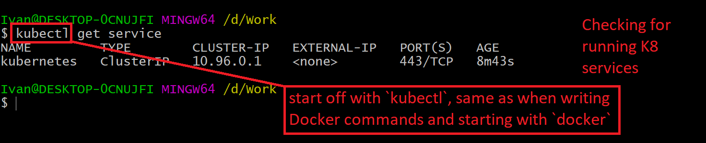

<h1>Welcome to my repository! Enjoy the quality content <3</h1>
<h2>Table of contents</h2>

- [SRE Intro](#sre-intro)
- [User Journey](#user-journey)
- [User Experience](#user-experience)
- [Cloud computing with AWS (Amazon Web Services)](#cloud-computing-with-aws-amazon-web-services)
  - [AWS Definition](#aws-definition)
  - [Global Infrastructure](#global-infrastructure)
  - [Benefits of Cloud Computing (Known as 4 pillars of Cloud Computing as well)](#benefits-of-cloud-computing-known-as-4-pillars-of-cloud-computing-as-well)
  - [Region VS Availability Zone](#region-vs-availability-zone)
  - [CDN Definition](#cdn-definition)
  - [On prem VS Hybrid VS Public Cloud](#on-prem-vs-hybrid-vs-public-cloud)
- [AWS -> localhost and back](#aws---localhost-and-back)
  - [How to launch an instance](#how-to-launch-an-instance)
  - [Lounch from an image (AMI)](#lounch-from-an-image-ami)
- [Linux Commands](#linux-commands)
  - [File Permissions](#file-permissions)
  - [Bash Scripting](#bash-scripting)
    - [nginx](#nginx)
    - [tomcat9](#tomcat9)
- [Further reading](#further-reading)
- [Architectures](#architectures)
  - [Monolith](#monolith)
  - [Microservices](#microservices)
    - [Best practice to adapt microservices](#best-practice-to-adapt-microservices)
  - [N-tier](#n-tier)
  - [Scaling out VS Scaling up](#scaling-out-vs-scaling-up)
    - [Scaling out](#scaling-out)
    - [Scaling up](#scaling-up)
- [SDLC – software development life cycle](#sdlc--software-development-life-cycle)
- [Github](#github)
- [S3 - Simple Storage Service](#s3---simple-storage-service)
- [Docker](#docker)
  - [Virtualisation VS Containerisation](#virtualisation-vs-containerisation)
  - [Setup](#setup)
  - [Docker commands](#docker-commands)
    - [Docker images and containers](#docker-images-and-containers)
    - [Remove container](#remove-container)
    - [Start/Stop container](#startstop-container)
  - [Uploading to Docker](#uploading-to-docker)
    - [First, log in](#first-log-in)
    - [Then, commit the changes](#then-commit-the-changes)
    - [Then, push to Docker Hub](#then-push-to-docker-hub)
    - [Pulling and running instance](#pulling-and-running-instance)
  - [Docker file to automate building of customised image](#docker-file-to-automate-building-of-customised-image)
    - [Other containerisation platforms](#other-containerisation-platforms)
    - [Automate nginx image example from above](#automate-nginx-image-example-from-above)
      - [Building it using script](#building-it-using-script)
    - [Test the image locally to ensure it works](#test-the-image-locally-to-ensure-it-works)
    - [Uploading local api to Docker](#uploading-local-api-to-docker)
      - [First, name a Dockerfile](#first-name-a-dockerfile)
      - [Next, make a .dockerignore file](#next-make-a-dockerignore-file)
      - [Then, build the api](#then-build-the-api)
      - [Funally, upload to Docker Hub](#funally-upload-to-docker-hub)
- [Kubernetes (k8)](#kubernetes-k8)
  - [Benefits](#benefits)
  - [Kubernetes deployment](#kubernetes-deployment)
  - [Kubernetes commands](#kubernetes-commands)
    - [For example, check services](#for-example-check-services)
  - [YAML](#yaml)
    - [File types](#file-types)
    - [Use cases](#use-cases)
  - [Plan for creating nginx example](#plan-for-creating-nginx-example)
  - [Creating](#creating)
  - [Delete pod](#delete-pod)
  - [Change number of pods](#change-number-of-pods)
  - [Example of deploying a local API](#example-of-deploying-a-local-api)
    - [First, create the .yml files for the API you want to upload](#first-create-the-yml-files-for-the-api-you-want-to-upload)
    - [Then, follow the list of commands below](#then-follow-the-list-of-commands-below)
- [Deploying other peoples' code](#deploying-other-peoples-code)
  - [Requirements for running K8 on Linux](#requirements-for-running-k8-on-linux)
  - [Create service on EC2](#create-service-on-ec2)
    - [First, create an EC2 instance that can handle the K8 and API](#first-create-an-ec2-instance-that-can-handle-the-k8-and-api)
    - [Next, intall Docker, kubectl and minikube on the EC2](#next-intall-docker-kubectl-and-minikube-on-the-ec2)
  - [Example: Link EC2 API with a DB on another EC2 instance](#example-link-ec2-api-with-a-db-on-another-ec2-instance)
    - [Overall plan](#overall-plan)
    - [Step by step](#step-by-step)
      - [DB part](#db-part)
      - [API part](#api-part)
      - [Connecting the two](#connecting-the-two)
- [That's pretty much it!](#thats-pretty-much-it)

<small><i><a href='http://ecotrust-canada.github.io/markdown-toc/'>Table of contents generated with markdown-toc</a></i></small>
# SRE Intro
Role of an SRE
- to check and maitain the code, ensuring the application is running at all times, thus providing positive user experience
# User Journey
- the path a user would take in order to complete a task, e.g. log into their account to upload a picture that others can see
# User Experience
- the level of satisfaction a user feels after performing a User Journey, for  example a bad exprerience would come as a result of failing to upload a new picture and getting an error code, whereas a good experience can come from successfully uploading the desired picture
# Cloud computing with AWS (Amazon Web Services)
## AWS Definition
- A cloud platform providing organisations with the required server space to store their information on the cloud and make it easily available to its users without the need for the organisation to invest money into the infrastructure
## Global Infrastructure
- AWS has servers in regions accross the globe, with multiple availability zones
- most common choice for organisations
- It provides organisations with the ability to keep their data safe and in multiple locations to reduce the time taken for requesting the data from users.
- 26 different regions
- 84 availability zones
- plans for future expansion
## Benefits of Cloud Computing (Known as 4 pillars of Cloud Computing as well)
- Ease of use
  - data is stored online, meaning every team member views the same data and any updates are immediately available for the team to view
  - makes quality control easier as all data is stored in the same place, i.e. nothing is ever lost
- Flexible
  - can always add more Regions or more Availability zones on demand, without the need to plan the expansion and spend time building it
  - can choose the Region you want the data stored on
  - can choose from different services, using only the services you need the application to have
- Robust
  - maintained and kept secure by Amazon, with the company investing into the best security meaning your data is as secure as possible
  - cannot lose data as it is stored on the cloud, meaning all the servers that the data is stored on need to be destroyed for the data to be lost
- Cost
  - pay as you go for the services and storage space, meaning you never pay more than what you're using
  - initial cost is high, but in the long run you end up saving money because resources are never wasted
## Region VS Availability Zone
- Regions
  - The areas of the globe where AWS servers are located, for example London, Paris, etc.
- Availability zones
  - the number of servers within that area of the globe (Region)
## CDN Definition
- content delivery network
- a geographically distributed network of servers which work together to provide content to users
## On prem VS Hybrid VS Public Cloud
- On prem
  - storing all the data of the organisation on the premises of the organisation, in other words running an internal server maintained by the organisation itself
- Public Cloud
  - a server on the web that stores all of the companies data, which is fully maintained by a different organisation
  - For example, using AWS, the server space is used by the individual company, but the maintanance is done by Amazon
- Hybryd
  - storing some of the information within the internal organisation server, and some on a public server like AWS
  - For example, a bank might keep your card information within the banks internal server, but keep a credit application form on a public server
# AWS -> localhost and back
- Our desktop or laptop has set hardware and software on it
- AWS doesn't, so we need to specify the size we want it to have
- need credentials (username, password, AWS keys) to have access
- check diagram for more:

## How to launch an instance
- add file.pem into the .ssh folder `c/users/ivan/.ssh` if it doesn't exist make one
- go to AWS website using the secret link, login using secret details
- leave most things default
- add the groups (default network for now/ group is eu-west-1a)
- add security groups (SSH for your own machine, others can be http before deployment, https after deployment)
  - you already have a security group so could just reuse it
- then change permitions of the file (command will be generated by AWS)
- then connect using the link provided (most of this is explained on the AWS page you will open with the link)
  - if not type in `chmod 400 (file.pem)`
  - then type `ssh -i (os name (e.g. ubuntu))@(Public IPv4 DNS address)` ( seems to end with compute.amazonaws.com )
- run update, upgrade and install nginx:
  - `sudo apt-get update -y`
  - `sudo apt-get upgrade -y`
  - `sudo apt-get install nginx -y`
## Lounch from an image (AMI)
- Same as normal really, no real difference in the settings
# Linux Commands
- how to start a service `sudo systemctl start name_service`
- how to stop a service `sudo systemctl stop name_service`
- sudo used for admin previleges, if you can't use a particular command because sudo is required you will get something like "permission denied"
- how to check the status `systemctl status name_service`
  - the type of service, for example nginx, NOT the name of the instance
  - the AWS instance is a PC in a way, this command checks the service running on that PC
- how to enable service `sudo systemctl enable name_service`
- how to remove a package `sudo apt-get remove name_package -y`
- how to see the processes runnig `top`
- who am I `uname` or `uname -a`
- where am I `pwd`
- create a directory `mkdir name_dir`
- how to see directories `ls` or `ls -a`
- how to create a file `touch name_file` or `nano name_file`
- how to check content of file without going inside the file `car name_file`
- how to move a file copy file.txt from current location into a folder `mv name_file path_location`
  - very important to put the correct path location, otherwise things might disappear... for example:

- how to copy a file file.txt from current location into a folder `cp name_file path_location`
  - differences between move and copy
    - `move` will change the file path, `copy` will create an identical file in the given location
    - if the location doesn't exist, `move` will fail to do it, BUT `copy` will create the required folder
- how to delete a file/folder `sudo rm -rf name_folder/name_file`
  - `-rf` here is for forcing it to be deleted even if it is open
## File Permissions
- how to check file permissions `ll`
- change file permissions `chmod required_pormission name_file`

- write `w` read `r` executable (.exe) `x`
  - for more info, check <https://chmod-calculator.com>
## Bash Scripting
### nginx
```bash
# Create a file called provision.sh

# It must start with #!/bin/bash
#!/bin/bash

# Run uppdates
sudo apt-get update -y

# Run upgrades
sudo apt-get upgrade -y

# Install nginx
sudo apt-get install nginx -y

# Ensure it's running - start nginx
sudo systemctl start nginx

# Enable nginx
sudo systemctl enable nginx

# Check the status
systemctl status nginx
```
### tomcat9
```bash
# Create a file called tomcat.sh

# It must start with #!/bin/bash
#!/bin/bash

# Run uppdates
sudo apt-get update -y

# Run upgrades
sudo apt-get upgrade -y

# Install tomcat9
sudo apt-get install tomcat9 -y

# Ensure it's running - start tomcat9
sudo systemctl start tomcat9

# Enable tomcat9
sudo systemctl enable tomcat9

# Check the status
systemctl status tomcat9
```
- after running the script
  - change the file to a .exe file
    - using `chmod +x name_file`
  - run the .exe file `./name_file`
# Further reading
- what is `VPC`
  - Virtual Private Cloud
  - A virtual private cloud (VPC) is a secure, isolated private cloud hosted within a public cloud.
  - example, imagine a restourant with a reserved table, i.e. only the people who reserved it can get on it
- What is `Internet gateway`
  - An internet gateway is a VPC component that allows communication between networks
  - something that is connected to the VPC to let it communicate with the internet
- what is `Route tables`
  - A route table contains a set of Destination-Target pairs, called routes, that determine where data can go
- what is `Subnet`
  - A subnet is a range of IP addresses defined for a network
- what is `NACLs`
  - A network access control list (ACL) is an optional layer of security for your VPC that acts as a firewall for controlling traffic in and out of one or more subnets. You might set up network ACLs with rules similar to your security groups in order to add an additional layer of security to your VPC
- what is `Security group`
  - A security group acts as a virtual firewall, controlling the traffic that is allowed to reach and leave the resources that it is associated with. For example, after you associate a security group with an EC2 instance, it controls the inbound and outbound traffic for the instance.
- How did you secure your app on the public cloud?
  - with the use of a security group, ensuring the ssh connection we made was only to our own IP at port 22
- What are the outbound rules for security groups by default? Why?

  - because this way inwards access is only given to VPCs with the same SG meaning they are within the VPC
  - and outward read-only trafic is allowed for everyone
- Command to kill a process in Linux
  - <https://www.geeksforgeeks.org/kill-command-in-linux-with-examples/>
# Architectures
## Monolith
- composed all in one piece - single-tiered
- in other words, it can have multiple components but it is deployed as `ONE APPLICATION`
- Benefits
  - simple to develop
  - simple to test
  - simple to deploy
  - cheaper to maintain
- Drawbacks
  - if it is too large it is hard to understand therefore hard to maintain
  - size of application can slow down start0up times
  - have to redeploy after every update
  - poor reliability - a single bug can take down the entire app
  - hard to scale up
- best suited for applications that do not have a future that involves scaling up
  - e.g. a school system (number of students is relatively similar every year, new ones come in but old ones go out)
## Microservices
- multiple services, each of which is self contained and responsible for one job
  - therefore can be deployed independantly
- need a small team to maintain
- each service operates on their own and is not dependant on the rest
- Benefits
  - easier to spot and fix bugs, also won't make the whole app crash
  - small teams needed to maintain which promotes agility
  - small code base therefore easier to maintain
  - easier scaling as services can be scaled individually without the need to touch the rest of the app
- Drawbacks
  - a lot more complex than Monolithic
    - more parts
  - harder deployment and testing as the dependencies between services are harder to test for
  - the freedom to use different languages can cause a lot of headaches when it comes to maintanance
  - the API designs need to be very good as to not cause additional latency
  - requires a team with a much higher skill set
### Best practice to adapt microservices
- start with 1-2 services, small teams, test, then move on
- use [Docker](#docker) to containerise your apps
- use [K8](#kubernetes-k8) to orchistrate and make your life easy

## N-tier
- divides an application into logical layers and physical tiers
  - layers are a way to seperate responsibilities, where each layer has a specific responsibility
  - higher layers can call lower layers but not the other way around
  - could have several layers on the same tier
  - tiers can communicate with all other tiers
- Benefits
  - portable between cloud and on-prem, and between cloud platforms
  - less of a learning curve for developers
  - evolution of the traditional model
- Drawbacks
  - monolitic design so cannot deploy single services
  - difficult to manage network security
  - it's easy to end up with a tier that does CRUD operations adding extra latency

## Scaling out VS Scaling up
### Scaling out
-  increasing the number of servers
- usually happens when the number of users increases
### Scaling up
- increasing the data load the server can take
- usually happens when the size of the data increases
# SDLC – software development life cycle
- It’s the process of end to end product development.
- Products need to follow a certain life cycle.
- The Stages are:
  - Planning
    - Just an idea, only in someone’s head
  - Designing
    - Writing out how the product will look and what it needs.
  - Development
    - Develop an environment that works for all of us. i.e the linux instance we created
    - Implementing the design.
  - Testing
    - Nothing goes to production without testing.
    - The test must pass in order to go to the next stage.
    - Beta versions can happen after testing to get feedback from the user.
  - Staging
    - It’s the holding area before the code gets deployed. The program is packaged and ready, just on hold till the release date. After staging the code is deployed.
# Github
- One person reviewing is always the best.
- Someone who is more knowledgeable should merge.
- `git` will tell you all the commands that can be performed on git
- If you delete the .git file you need to reconnect to the github remote before pushing the code back to github
  - in other words it makes the folder not be a repo anymore
# S3 - Simple Storage Service
- Globally available - have access regardless of the region you use
- Tends to be used a lot by orgs when they save past employee records

- Commands for s3 follow a certain pattern of writing

- AWS S3 also has a naming convention
  - `-` instead of `_`
  - cannot use upper case letters  

- Remove bucket
  - first of all, all the files need to be removed from the bucket, otherwise it will fail

# Docker
- Everything on Docker Hub is an image that you can download, versions and all
- once you download the version of the image and make it a container, you can do whatever you want with it
- `BUT` the original image will not change  

## Virtualisation VS Containerisation
- virtualisation takes a large slice to run
- containerisation (docker) shares the resources
- (add more about this, maybe examples)
## Setup
- Install docker from official website
- make sure WSL2 is selected when installing
- then follow this to enable Hyper-V
  - <https://www.asus.com/support/FAQ/1038245/>
  - `NOTE: this only works for my motherboard, will have to check the exact steps for other motherboards`
- then starting docker will give a prompt to update linux kernel (might be called something else I forgot)
  - follow the link, complete step 4, which is the one to install the file needed for update
- after that, docker should run fine
## Docker commands
### Docker images and containers

### Remove container

### Start/Stop container

## Uploading to Docker
### First, log in
- if you are logged into local docker, it should authorize automatically
- if not just put credentials in  

### Then, commit the changes
- command is `docker commit CONTAINER_ID USERNAME/REPO_NAME:TAG`
- very important to have the username in there, it is what tells docker where to put the commit

### Then, push to Docker Hub
- just run `docker push CONTAINER_ID USERNAME/REPO_NAME:TAG`
- i.e. replace commit with push
- NOTICE: for pushing mentioning the tag also puts that tag on there for people when pulling
- NOTE: if the repo doesn't exist within Docker Hub, Docker will create it and add the image you want to push

### Pulling and running instance
- run the following command `docker run -d -p 70:80 ivangelemerov/105_sre_docker_practice:v1`
  - more generic: `docker run -d -p PORT_LOCAL:PORT_APP CONTAINER_ID USERNAME/REPO_NAME:TAG`

- NOTICE:
  - this comes from an nginx image, therefore runs on port 80
  - it was committed with the tag v1, therefore tag has to be included when pulling
    - if it isn't it will look for `latest` version of ivangelemerov/105_sre_docker_practice
    - which in this case, doesn't exist

## Docker file to automate building of customised image
- Building a microservice
### Other containerisation platforms
- Crio
- Rocket
- Docker is most popular
### Automate nginx image example from above
- Create a `Dockerfile`
  - spelled like this, capital D and all
  - in same location as index.html for ease of use
- Decide which base image to use for your image
  - we started with nginx as base image
  - if we wanna make new changes in our v1 of our image, we need to load the image and then change that, save it as v2
#### Building it using script
- this will let us build the image locally, not on Docker Hub just yet
- docker just checks if the command can run, doesn't check if, for example, the .html file is empty
- if some command cannot execute, then Docker will stop execution
  - might create an image still, but it won't be functional

### Test the image locally to ensure it works
- Confirm the image is there by showing all images

- then try running the image we created
  - if you want to see the logs, run same command without `-d`
  - `dopcker run -p PORT_LOCAL:PORT_REQUIRED IMAGE_NAME`

- if it has worked correctly, refreshing the page will be reflected in the logs
  - remember to run without `-d` to see the logs


### Uploading local api to Docker
- in short, follow this tutorial
  - <https://www.youtube.com/watch?v=f0lMGPB10bM>
- if it doesn't work, follow the below
#### First, name a Dockerfile
- go into the repo for the project and make a Docker file there

#### Next, make a .dockerignore file

#### Then, build the api
- follow instructions above for building [go to section](#building-it-using-script)
- then check if the image was built [go to section](#docker-images-and-containers)
- then run the image [go to section](#pulling-and-running-instance)
- check to make sure it works [go to section](#docker-images-and-containers)
#### Funally, upload to Docker Hub
- follow instructions above [go to section](#then-push-to-docker-hub)
# Kubernetes (k8)
- container orchestration platform
- build by Google, used for over 15 years
- made open source in 2014
- used by over 2/3 of orgs (according to 2017 report)
## Benefits
- self healing
  - `NO` single point of failure
  - what happens if something breaks
    - just stop it
    - balance the load for a little while
      - i.e. share the load between the remaining pods
    - fix the problem (self heal)
    - set it up again, so it works like it did before breaking

- load balancing
  - can change way of managing based on the load on the system
  - i.e. if the load increases, it will share it between the pods
  - similarly, if it doesn't need all the extra pods, it will remove them
## Kubernetes deployment
- deploy replicas of the same image, so that it can balance the load

## Kubernetes commands
- `kubectl` in kubernetes is the equivalent to `docker` for Docker
  - meaning all K8 commands start off with `kubectl`

- in general, you can use `kubectl COMMAND_NAME --help` to get more info about the command
  - for example, running `kubectl get --help`

### For example, check services

- services: deployment, service, pods, replicasets, crobjob, autoscalinggroup, horizontal pod scaling group (HPA)
  - kubectl get service_name/deployment/pod
  - kubectl get deploy nginx_deploy (nginx_svc)
  - kubectl get pods
  - kubectl describe pod pod_name
## YAML
- easy to read
- easy to understand
- hard to type, because of indentation
  - you need to have every indent be 2 spaces
  - in VSCode, `TAB` automatically does 2 spaces over usual 4
- could add multiple yml files together, but the `order` mathers
### File types
- file.yml and file.yaml, both fine
- How to declare it, use `---`
### Use cases
- can be utalised with K8, Docker-compose, Ansible, Cloud-formation
- to codify anything and everything in order to automate processess
## Plan for creating nginx example
- Structure

- create a folder for the project, say nginx_deploy
- create a file for nginx_deployment.yml
- create a file for nginx_svc.yml
- localhost:port
## Creating
- after making the YML file, we run the following
  - `kubectl create -f FILE_NAME.yml`
- if it worked, we should get a created message
  - if we want to make sure, we run `kubectl get pods`
  - it should have the specified number of pods (in this case 3)

## Delete pod

## Change number of pods

## Example of deploying a local API
### First, create the .yml files for the API you want to upload
- `NOTE:` could make a folder to put the file into as well
- the commands below need to be ran inside the folder the files are in
- deployment file:
```YML
# YML is case sensitive - indentation of YML is important
# i.e use spaces over TAB
apiVersion: apps/v1 # which api to use for deployment
# this is decided by the people who made it, look at documentation to know what to put there
kind: Deployment # what kind of service you want to create
# what would you like to call it
metadata:
  name: <DEPLOYMENT_NAME> # naming the deployment
spec:
  selector:
    matchLabels:
      app: <LABEL> # look for this label to match with K8 service
  
  # Let's create a replice set of this with 3 instances/pods
  replicas: POD_NUMBER
  # template to use it's label for K8 service to launch in the browser
  template:
    metadata:
      labels:
        app: <LABEL> # This label connects to the service or any other K8 components
    # Let's define the container spec
    spec:
      containers:
      - name: <LABEL>
        image: <DOCKERHUB_LINK>
        ports:
        - containerPort: 80
```
- service file:
``` YML
# Select the type of API version and type of service
apiVersion: v1
kind: Service
# Metadata for name
metadata:
  name: <SERVICE_NAME>
  namespace: default
# Specification to include ports Selector to connect to the deploy
spec:
  ports:
  - nodePort: 31000 # ranges from 30000-32768 
    port: <PORT_LOCAL>
    protocol: TCP
    targetPort: <PORT>
# Let's define the selector and label to connect to nginx-deployment
  selector:
    app: <LABEL> # this label connects this service to deployment
# Creating LoadBalancer type of deployment
  type: LoadBalancer
```
### Then, follow the list of commands below
```bash
kubectl get deploy # this will show you all the deployments you have made, it could be empty if you've never done this before
kubectl create -f DEPLOYMENT_FILE.yml # this will deploy the project, you can run get deploy to check this worked
kubectl create -f SERVICE_FILE.yml # this will deploy the service
kubectl get svc # this will show you all the running services, it will put the service name there
```

# Deploying other peoples' code

- need to ask for the requirements of the code they want to deploy
  - first off, requirements for the EC2, i.e. storage, CPUs, RAM, all of it
  - then, in the security group (SG), what ports to allow for the app to run
  - then, software the app needs to run, K8/Docker + whatever their code needs
    - `NOTE:` K8 uses up 1 CPU, so make sure minimum EC2 requirements match this as well
## Requirements for running K8 on Linux
- minimum requirements for ec2
  - "hardware", i.e. storage space, ram etc
- OS
  - in our case `Linux ubuntu 18.04`
- dependencies
  - software that is needed, in our case `Docker Desktop` and `K8` on `Linux`
  - here, K8 cannot be installed as `Docker Desktop` cannot be installed
  - therefore find replacement, aka `minikube`
## Create service on EC2
- follow this guide <https://aws.plainenglish.io/running-kubernetes-using-minikube-cluster-on-the-aws-cloud-4259df916a07>
### First, create an EC2 instance that can handle the K8 and API
- Ubuntu Server 18.04
- t2.medium
- 8gb storage
- script for ec2 launch:
```bash
#!/bin/bash
sudo apt update -y
sudo apt upgrade -y
```
- Security Group:
  - TCP 30000-32768 (range for the NodePorts for K8 deployment)
  - MSSQL at port 1433
  - HTTP
  - SSH at port 22
### Next, intall Docker, kubectl and minikube on the EC2
- `NOTE:` make sure you have run update and upgrade before this
```bash
# install docker
sudo apt install docker.io -y

# check docker
sudo docker --version
# this is just to check it's running, it is not needed to make the code work
sudo docker run hello-world

# install kubectl
curl -LO https://storage.googleapis.com/kubernetes-release/release/`curl -s https://storage.googleapis.com/kubernetes-release/release/stable.txt`/bin/linux/amd64/kubectl

chmod +x ./kubectl

sudo mv ./kubectl /usr/local/bin/kubectl 

# install minikube
curl -Lo minikube https://storage.googleapis.com/minikube/releases/latest/minikube-linux-amd64

chmod +x minikube 

sudo mv minikube /usr/local/bin

# check version
minikube version

# install conntrack
sudo apt install conntrack

# start minikube
sudo minikube start --driver=none
```
- if all has been done correctly, you should see the following when running `sudo docker ps`


## Example: Link EC2 API with a DB on another EC2 instance
- Follow the guide provided on [AWS](https://docs.aws.amazon.com/AmazonRDS/latest/UserGuide/USER_VPC.Scenarios.html) under section *"A DB instance in a VPC accessed by an EC2 instance in the same VPC"*
### Overall plan
- Using a Docker image, create the Northwind database on an EC2 instance with K8 running
  - make sure to have nothing in the Security Group, apart from maybe SSH in case we want to run tests from our PC
- Get the `IP address` of that image, along with the NodePort we want the database to be contacted on
- Then, open the Docker image of our API, and add the `IP address` in the connection string, in the file called `appsettings.json`

- Then, upload that image to Docker Hub, and use that image to deploy an EC2 of the API
- Then, once the API is deployed, get it's `IP address along with the NodePort` and add it to the Security Group of the database
- After all this is done, the IP of the API should be able to contact the database and get back a response
- `NOTE:` the order here matters a lot, we cannot make the API first and then make the database, it has to be database first `then` API
### Step by step
#### DB part
- create an EC2 for the database, following the [guide above](#first-create-an-ec2-instance-that-can-handle-the-k8-and-api), and `ONLY ADD` SSH to the security group for now
- install Docker, kubectl and minikube as described above
- copy the .yml files to create the database
  - use this command `scp -i /path/my-key-pair.pem /path/my-file.txt ec2-user@my-instance-public-dns-name:path/`
  - after doing this, using the command `ls` should yeld this

- execute the .yml files, deployment followed by service file
  - if all worked well, you should see this
  - `insert image of k8 cluster`
- this concludes the database part
  - if you want to check, open `SQL Server Management Studio (SSMS)` and connect to the database using the EC2 `IP address along with the NodePort` specified in the .yml files `(31000)`
#### API part
- now, we edit the API file with the new IP
  - find the `appsettings.json` file as [above](#overall-plan)
  - replace localhost with the `EC2 IP address followed by the NodePort`
    - should look something like `176.34.78.96,31000`
    - `NOTICE:` there is a coma after the IPv4, that is needed, it is not a typo
- after the API has been altered, [commit and push](#then-push-to-docker-hub) it to Docker Hub
  - if anyone other than the owner of this README is using this, note that at this point you will need to alter the image for the API
  - go into the api_deployment.yml file and change the image name from the one I have put down to the one you want to use
  - you can do this in the EC2 instance by running `nano api_deployment.yml` or by editing it in your own PC and trasfering the file again
    - if you transfer again it will override the file that is already there
- now, start an EC2 instance with the same requirements as [above](#first-create-an-ec2-instance-that-can-handle-the-k8-and-api)
- transfer the `api_deployment.yml` and `api_service.yml` files to the instance
- [create](#then-follow-the-list-of-commands-below) the API service
  - if it was done correctly, it will look like this
  - `add image`
#### Connecting the two
- now that the API is running with the IP of the database, and the database is runnig and ready, we just need to give the API access to the database
- we do this by adding the `IP address` of the API to the security group of the database
- go to the EC2 instance of the database and open the security group
  - assuming you gave the group no name, it will be auto generated and will look something like this

- we now want to add the IP of the API EC2
  - click on `Edit inbound rules` above
  - click on `Add rule`
  - a new row will appear, we want to edit that
  - leave the type as `Custom TCP`
  - add `31000` to the `Port range` column
  - leave `Source` as `Custom`
  - add the IP of the API EC2 to the box after the dropdown
  - after you add the IP in there, it will give you a dropdown with the same IP followed by `/32`, that is good click on it
  - now `Save rules`
- if you followed all the steps, the security group should look like this

# That's pretty much it!